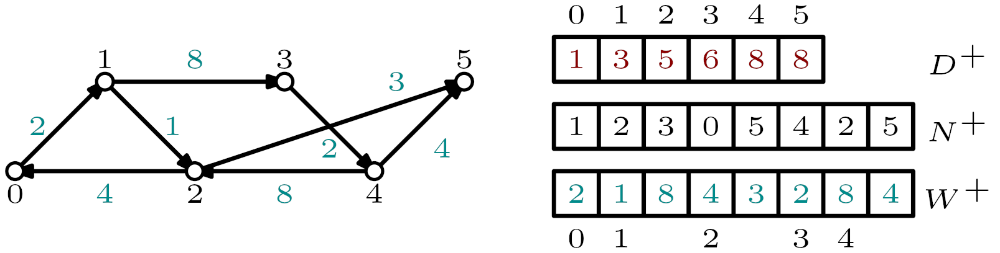

# [Directed Louvain algorithm](#mainpage)                       

The algorithm used in this package is based on the Louvain algorithm developed by V. Blondel, J.-L. Guillaume, R. Lambiotte, E. Lefebvre and was downloaded on the [Louvain algorithm webpage](https://sites.google.com/site/findcommunities/) (**[1]**).
The algorithm was then adjusted to handle directed graphs and to optimize directed modularity of Arenas _et al._ (**[2]**).
These modifications were mostly made by [Anthony perez](https://www.univ-orleans.fr/lifo/membres/Anthony.Perez) and by [Nicolas Dugué](https://lium.univ-lemans.fr/team/nicolas-dugue/).

The directed modularity is proved to be more efficient in the case of directed graphs as shown in [Direction matters in complex networks: A theoretical and applied study for greedy modularity optimization](https://doi.org/10.1016/j.physa.2022.127798) and [Directed Louvain : maximizing modularity in directed networks](https://hal.archives-ouvertes.fr/hal-01231784) (**[3,4]**). **For any citation of this work please use the following**: 

    @article{DP22,
        author  = {Nicolas Dugué and Anthony Perez},
        title   = {Direction matters in complex networks: A theoretical and applied study for greedy modularity optimization},
        journal = {Physica A: Statistical Mechanics and its Applications},
        volume  = {603},
        pages   = {127798},
        year    = {2022},
        issn    = {0378-4371},
        doi     = {https://doi.org/10.1016/j.physa.2022.127798},
    }
---

### [Graph representation: CSR format](#CSR)

Graphs are stored under the [Compressed Sparse Row (CSR)](https://en.wikipedia.org/wiki/Sparse_matrix#Compressed_sparse_row_(CSR,_CRS_or_Yale_format)) format.  
Several structures are containing the whole graph information: 
+ two arrays of **cumulative degrees** (out- and in-degrees): for out-degrees, each index _i_ contains the sum of all out-degrees for nodes from _0_ to _i_. 
+ two arrays of outcoming and incoming **arcs**: the _d(0)_ (out- or in-degree of node _0_) first values contain neighbors of node _0_ and so on.   
To find the first neighbor of a given node _i_ one simply needs to consider the difference between cumulative degrees of _i_ and _i-1_.
+ two array of outcoming and incoming **weights**: similar to the previous ones but store weights instead of node identifiers. 

Example of CSR format for a directed graph. The displayed arrays contain information regarding out-neighbors and weighted out--degrees only.

-----------------------------------------------------------------------------
## References
* **[1]** Vincent D. Blondel, Jean-Loup Guillaume, Renaud Lambiotte, Etienne Lefebvre. [Fast unfolding of communities in large networks](https://arxiv.org/pdf/0803.0476.pdf). Journal of Statistical Mechanics: Theory and Experiment, 2008, vol. 2008, no 10, p. P10008.
* **[2]** Alexandre Arenas, Jordi Duch, Alberto Fern\'andez, Sergio G\'omez. [Size reduction of complex networks preserving modularity](https://iopscience.iop.org/article/10.1088/1367-2630/9/6/176/pdf). New Journal of Physics 9, 176, 2007.
* **[3]** Nicolas Dugué, Anthony Perez. [Direction matters in complex networks: A theoretical and applied study for greedy modularity optimization](https://doi.org/10.1016/j.physa.2022.127798). Physica A: Statistical Mechanics and its Applications, 603, 2022.
* **[4]** Nicolas Dugué, Anthony Perez. [Directed Louvain: maximizing modularity in directed networks](https://hal.archives-ouvertes.fr/hal-01231784/document). Research Report, Université d'Orléans. 2015.
